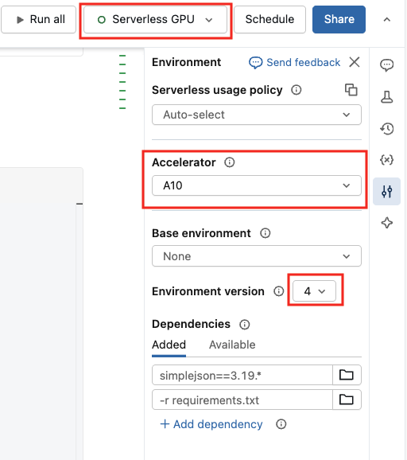
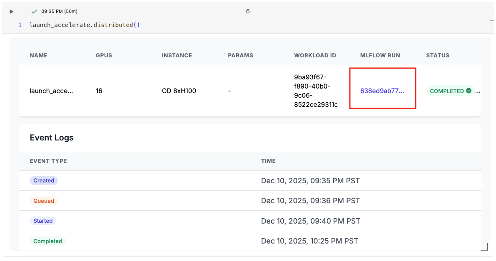
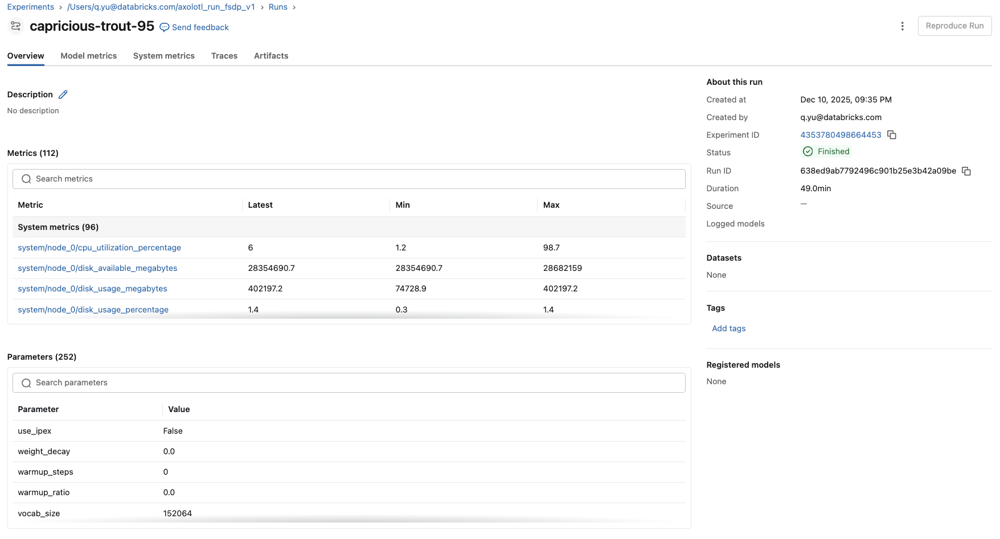
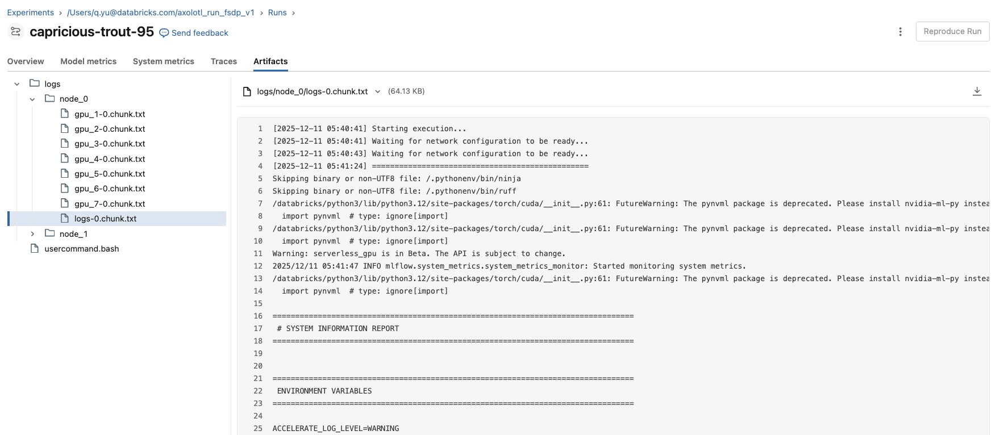

# databricks-SGC-Axolotl-examples

This repo contains examples of running LLM FFT with Axolotl on the Databricks Serverless GPU

## Quick Start

1. Login to your databricks workspace home, use **Create** Button at the top right to select **Git folder**

2. Add `https://github.com/qian-yu-db/databricks-SGC-Axolotl-examples.git` to **Git repository URL**, use "github" as Git proivider, click **Create Git folder**

3. Navigate to `notebooks` sub directory and open axolotl_run

4. Connect to **Serverless GPU** and select **Accelerator** `A10` and **Environment version** `4`. It is recommended to connect the notebook to `A10` node for quicker connection and execution of package setup steps. Users can request `H100` node for the model training section of the code using `@distributed` decorator

5. Customize and run the notebook for training, SGC will automatically log the training run as a mlflow experiment run where you can view the metrics and logs

## Reference

* [Databricks Serverless GPU](https://docs.databricks.com/aws/en/compute/serverless/gpu)
* [Databricks CLI](https://docs.databricks.com/aws/en/dev-tools/cli/tutorial)
* [Databricks Python SDK](https://databricks-sdk-py.readthedocs.io/en/latest/dbdataclasses/jobs.html)

